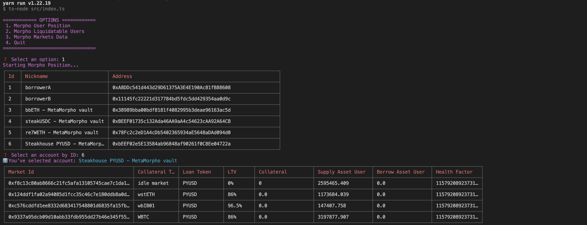

# Track Morpho Blue

## Overview

Track Morpho Blue is an educational project designed to help you monitor and track various metrics related to the Morpho Blue protocol. This tool allows you to fetch market data, display user positions, and manage accounts using an interactive command-line interface.



## Features

- Fetch and display market data
- Display individual and all users' positions
- Interactive command-line interface

## Installation

To get started with this project, follow these steps:

1. Clone the repository:

   ```bash
   git clone https://github.com/tomrpl/morpho-blue-tools.git
   cd morpho-blue-tools
   ```

2. Install dependencies:
   ```bash
   yarn install
   ```

## Configuration

Ensure you have a \`.env\` file with the following configuration:

```
RPC_URL=<Your RPC URL>
```

## Usage

To run the project, use the following command:

```bash
yarn start
```

You will be prompted with options to select and view different metrics related to Morpho Blue. The available options are:

1. Morpho Position
2. Morpho Users
3. Morpho Markets Data
4. Quit

### Example Commands

- **Initialize the project**:

```bash
yarn init
```

- **Run the main script**:

```bash
yarn start
```

## Contributing

Contributions are welcome! To contribute, follow these steps:

1. Fork the repository.
2. Create a new branch (`git checkout -b feature-branch`).
3. Make your changes and commit them (`git commit -m 'Add some feature'`).
4. Push to the branch (`git push origin feature-branch`).
5. Open a pull request.

### Issues

Feel free to open any issue [here](https://github.com/tomrpl/morpho-blue-tools/issues) or contact me directly.

## License

This project is licensed under the MIT License.

## Additional Information

### Adding Markets to Track

To add the market you are expecting to track, edit the `src/fetcher/marketsId.ts` file.

### Increasing Positions to Track

To increase the positions you expect to track, modify the relevant settings in the `.mp` file.
